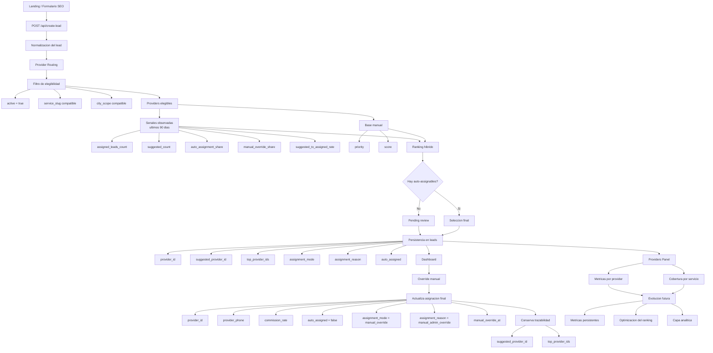

# Provider Routing Diagram

Este documento resume visualmente la arquitectura actual del sistema de routing de proveedores en HolaTacna y deja visible la evolucion prevista hacia una capa mas fuerte de metricas y optimizacion.

## Flujo principal

## Capas del sistema

### 1. Entrada del lead

- Las landings SEO y formularios envian el lead a `app/api/create-lead/route.ts`.
- En esta capa se normalizan datos como `service_name`, `service_slug`, `city_interest`, tracking y extras.

### 2. Routing de proveedores

- `lib/provider-routing.ts` toma el lead normalizado y arma el universo de providers elegibles.
- Primero filtra elegibilidad operativa:
  - `active = true`
  - compatibilidad por `service_slug`
  - compatibilidad por `city_scope`

### 3. Senales observadas

- En Fase 3B, el routing consulta una sola vez `leads` por ejecucion y agrega en memoria senales recientes.
- Senales usadas hoy:
  - `assigned_leads_count`
  - `suggested_count`
  - `auto_assignment_share`
  - `manual_override_share`
  - `suggested_to_assigned_rate`

### 4. Ranking hibrido

- El orden final combina:
  - control manual: `priority`, `score`
  - senales observadas recientes
- Las senales observadas solo ajustan el orden; no reemplazan el control manual.
- Si fallan las senales observadas, el routing cae a valores neutrales y el flujo sigue operando.

### 5. Decision final del motor

- Si no hay elegibles:
  - `assignment_mode = pending_review`
  - `assignment_reason = no_eligible_provider`
- Si hay elegibles pero no auto-assignables:
  - `assignment_mode = pending_review`
  - `assignment_reason = no_auto_assignable_provider`
- Si hay auto-assignables:
  - se persiste la asignacion final automaticamente
  - `assignment_mode = auto_assigned`
  - `assignment_reason = ranked_auto_assign`

### 6. Persistencia en `leads`

- El resultado del motor deja trazabilidad minima en la tabla `leads`:
  - `provider_id`
  - `suggested_provider_id`
  - `top_provider_ids`
  - `assignment_mode`
  - `assignment_reason`
  - `auto_assigned`

### 7. Operacion en Dashboard

- El dashboard muestra:
  - proveedor asignado final
  - proveedor sugerido
  - modo y motivo de asignacion
  - top sugeridos
- Desde el dashboard, el admin puede hacer override manual.

### 8. Override manual

- El override no destruye la recomendacion original.
- Actualiza solo el estado final operativo del lead:
  - `provider_id`
  - `provider_phone`
  - `commission_rate`
  - `auto_assigned = false`
  - `assignment_mode = manual_override`
  - `assignment_reason = manual_admin_override`
  - `manual_override_at`
- Conserva:
  - `suggested_provider_id`
  - `top_provider_ids`

### 9. Metricas por proveedor

- El panel `/providers` ya muestra:
  - asignados
  - auto
  - override
  - sugerido
- Y en fases posteriores agrega:
  - ratios por provider
  - cobertura por servicio

### 10. Evolucion futura

Siguiente direccion natural del sistema:

- persistir metricas resumidas si el volumen crece
- separar observabilidad operativa de analitica historica
- fortalecer el ranking hibrido con una capa de optimizacion mas estable

## Lectura recomendada

Para entender el sistema de izquierda a derecha:

1. el lead entra por `create-lead`
2. pasa por filtro de elegibilidad
3. recibe ranking hibrido
4. se persiste la decision final y la sugerencia original
5. dashboard y providers panel consumen esa trazabilidad
6. el override manual corrige la asignacion final sin borrar la historia del motor
